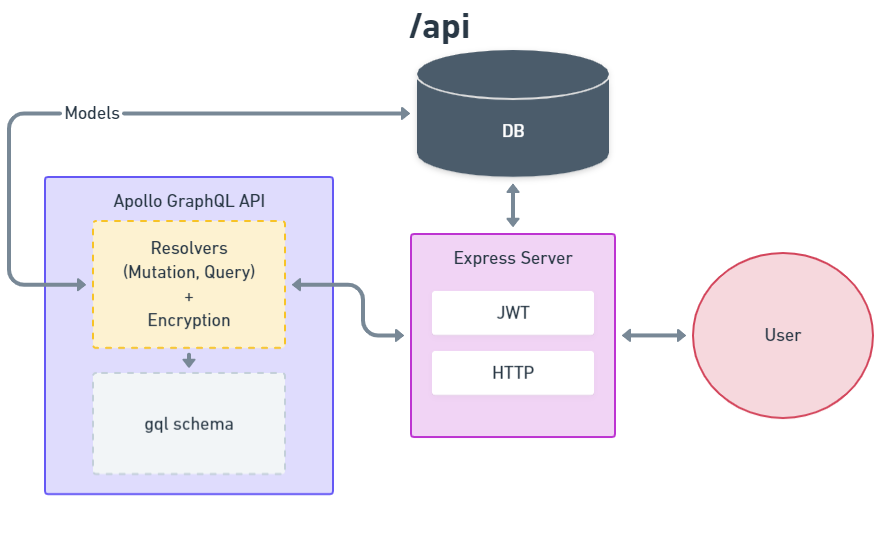

~~~
********** Starting Server **********
> npm run dev
*************************************

---------- Used Node Modules ----------
* NodeJS - 14.16.0 LTS
* Apollo (GQL API)
* Express (server)
* Mongoose (db connection)
* bcrypt (hashing, salting)
* JWT (session management)

---------- Project Structure ---------- 
/src 
├── models (mongoose schema)
│   ├── index.js *
│   ├── note.js
│   └── user.js
├── resolvers (graphql resolvers)
│   ├── index.js *
│   ├── mutation.js
│   ├── note.js
│   ├── query.js
│   └── user.js
├── util (utillity codes)
│   ├── gravatar.js
│   └── jwt.js
├── db.js (db connection codes)
├── index.js *
└── schema.js (graphQL schema)

---------- Adding a new feature ----------
1. Write a new GraphQL Schema.
2. Write corresponding database schema.
3. Write query or(and) mutation resolvers.
~~~