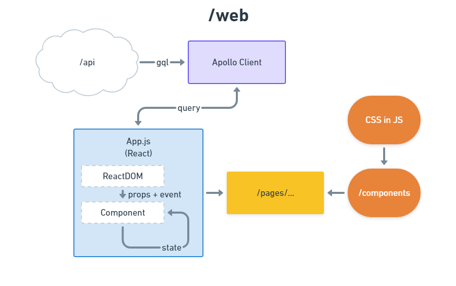

~~~
/src
├── components
│   ├── Button.js
│   ├── ButtonAsLink.js
│   ├── DeleteNote.js
│   ├── FavoriteNote.js
│   ├── GlobalStyle.js
│   ├── Header.js
│   ├── Layout.js
│   ├── Navigation.js
│   ├── Note.js
│   ├── NoteFeed.js
│   ├── NoteForm.js
│   ├── NoteUser.js
│   └── UserForm.js
├── gql
│   ├── mutation.js
│   └── query.js
├── img
│   ├── favicon.ico
│   └── logo.svg
├── pages
│   ├── edit.js
│   ├── favorites.js
│   ├── home.js
│   ├── index.js
│   ├── mynotes.js
│   ├── new.js
│   ├── note.js
│   ├── signin.js
│   └── signup.js
├── App.js
└── index.html

----- Used Libraries -----
1. React - ui framework
2. Parcel - bundling
3. styled-components - cs-in-js
~~~